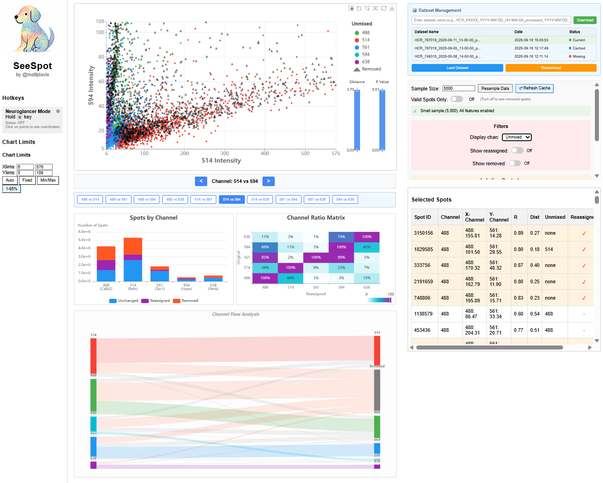

# see-spot

[](LICENSE)

[](https://github.com/semantic-release/semantic-release)


## App UI

*Interactive dashboard showing spot channel analysis with Sankey flow diagram, scatter plot, and summary statistics*

## start-up (local)
+ Install
  + `uv sync`
+ Launch: 
```bash
cd /home/matt.davis/code/see-spot && source .venv/bin/activate && cd src && uvicorn see_spot.app:app --host 0.0.0.0 --port 9999 --reload
```

## Contributing

### Linters and testing
```bash
coverage run -m unittest discover && coverage report
interrogate .
flake8 .
black .
isort .
```

### Pull requests

+ Internal members, please create a branch. 
+ External members, fork repo and open PR

### Commit style
+ We primarily use [Angular](https://github.com/angular/angular/blob/main/CONTRIBUTING.md#commit) style for commit messages. Roughly, they should follow the pattern: 
+ `<type>: <short summary>`


#### Type:
- **build**: Changes that affect build tools or external dependencies (example scopes: pyproject.toml, setup.py)
- **ci**: Changes to our CI configuration files and scripts (examples: .github/workflows/ci.yml)
- **docs**: Documentation only changes
- **feat**: A new feature
- **fix**: A bugfix
- **perf**: A code change that improves performance
- **refactor**: A code change that neither fixes a bug nor adds a feature
- **test**: Adding missing tests or correcting existing tests

